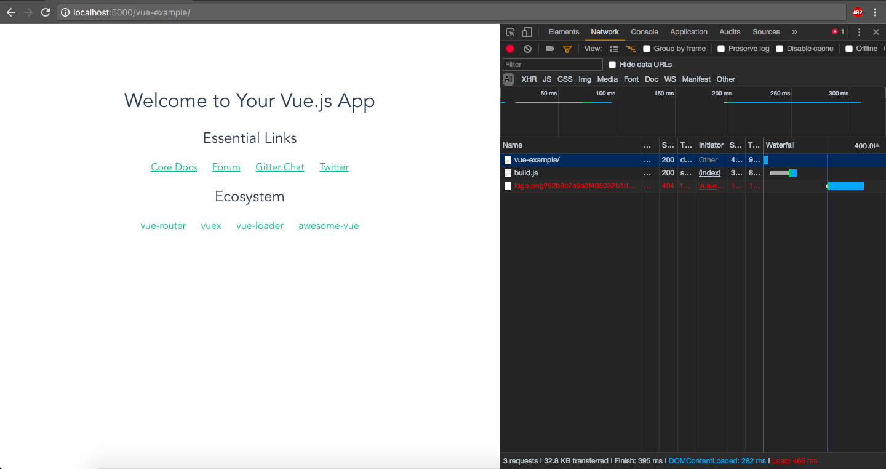
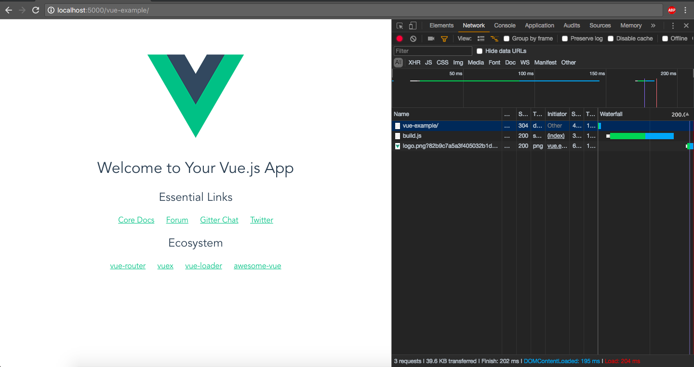

# vue-example

> A straightforward implementation of the boilerplate generated by `vue-cli` with the `webpack-simple` template... for testing of an issue.

## The Issue

Serving the site from GitHub Pages in a project path (a subdirectory) yields errors with built assets pulling from `src/assets`, such as `logo.png`.

### The Resolution

How I "solved" it, although there is probably an easier way.

#### Before


#### After


[Check out the diff!](https://github.com/edm00se/vue-webpack-simple-example/compare/a53181f...6c8488f).

## Build Setup

``` bash
# install dependencies
npm install

# serve with hot reload at localhost:8080
npm run dev

# build for production with minification
npm run build
```

For detailed explanation on how things work, consult the [docs for vue-loader](http://vuejs.github.io/vue-loader).
